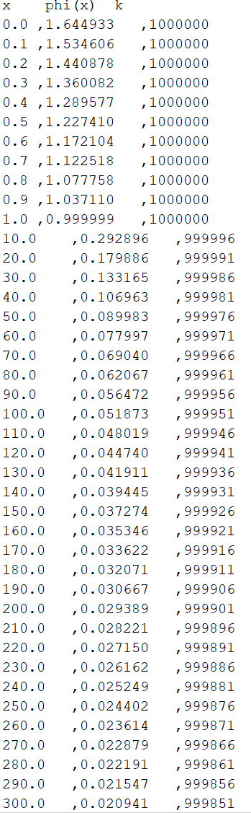
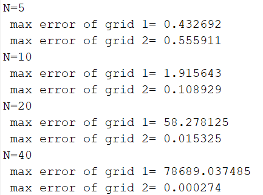
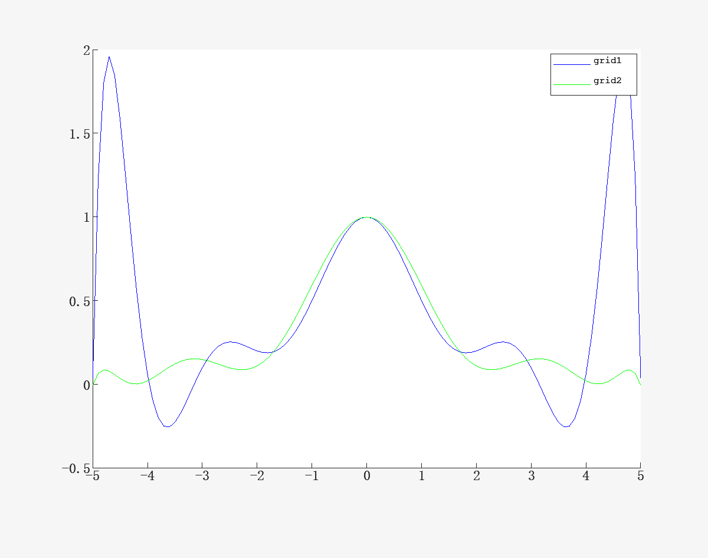

# 第一周程序作业

## Problem

### code0

对级数$\varphi (x)=\sum_{n = 1}^{\infty} \frac{1}{k(k+x)}$, x取值x = 0.0, 0.1, 0.2, · · · , 1.0, 10.0, 20.0, · · · , 300.0共41个值，要求误差小于$10^{−6}$，并给出相应的k的取值上界(找到满足条件的最小的k)。

### code1

对函数$f(x)=\frac{1}{x^2+1}，x\in [-5,5]$，构造Lagrange插值多项式$p_L(x)$，插值节点取为:

1. $x_i=5-i \frac{10}{N}, i = 0, 1, · · · , N$

2. $x_i = −5 cos(\frac{2i + 1}{2N + 2}\pi), i = 0, 1, · · · , N$ (Chebyshev point)

并计算如下误差$max_i{|f (y_i) − p(y_i)|, y_i =\frac{i}{10}− 5, i = 0, 1, · · · , 100}$

对N = 5, 10, 20, 40比较以上两组节点的结果，并在一张图中画出N = 10时$f (x)$数值计算结果。

## Method

### code0

先求出级数的近似值，使用循环结构逐次加$\frac{1}{k(k+x)}$，直到小于要求的误差。

近似认为$\frac{1}{k(k+x)}\leq 10^{-12}$时，有限项和的误差小于要求的误差。

### code1

对给定的插值节点构造Lagrange插值多项式

- $p_L(x)=\sum _{i=1}^{n}f(x_i)\prod_{j\neq i}\frac{x-x_j}{x_i-x_j}$

## Result

### code0

<figure>

</figure>

### code1

<figure>

</figure>