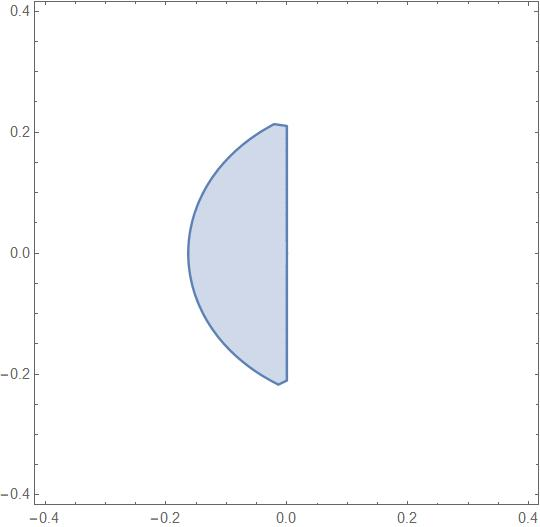
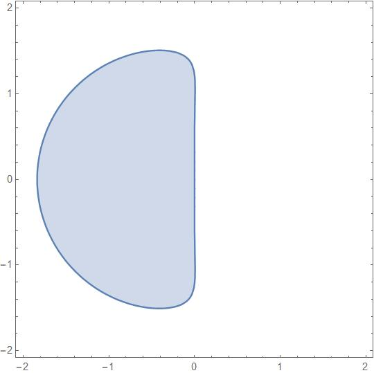

# 
第十一周程序作业

## Introduction

### code_st

画出五阶Adams-Bashforth公式和五阶Adams-Moulton公式的绝对稳定性区域。

### 计算机习题8.9

编写有限差分法求解线性两点边值问题的通用计算机程序，求解以下问题：
1. $$x'=-x$$
    $$x(0)=3,x(\frac{\pi}{2})=7$$
准确解$x(t)=7sin(t)+3cos(t)$

2.  $$x''=2e^t-x$$
    $$x(0)=2,x(1)=e+cos1$$
准确解$x(t)=e^t+cos(t)$

取n=10，20，40，80，160求解，并计算误差阶
## Method

### code_st
Adams-Bashforth公式如下
$$y_{n+1}=y_n+\frac{h}{720}(1901f_n-2774f_{n-1}+2616f_{n-2}-1274f_{n-3}+251f_{n-4})$$

对应的特征方程为
$$z^5=z^4+\frac{\lambda h}{720}(1901z^4-2774z^3+2616z^2-1274z+251)$$
$$\mu =\lambda h$$
方程的根为$z_1,z_2,...,z_5$
对应区域为$\{\mu \in \mathbb{C} \vert    |z_i|\leq 1,i=1,...,5\}$

### 计算机习题8.9

待求解的微分方程为
$$y''=f(x,y,y')=u(x)+v(x)y+w(x)y' $$
$$y(a)=\alpha,y(b)=\beta$$
将区间$[a,b]$等距分划$a=t_0 , t_1, ... ,t_{n+1}=b$
$$t_i=a+ih,h=\frac{b-a}{n+1}$$
近似为离散形式
$$y_0=\alpha,y_{n+1}=\beta$$
$$(1+\frac{1}{2} hw_i)y_{i-1}-(2+h^2v_i)y_i+(1-\frac{1}{2}hw_i)y_{i+1}=h^2u_i$$
构造三对角矩阵求解y即得。

## Result

### code_st
#### Adams-Bashforth公式

#### Adams-Moulton公式

### 计算机习题8.9
本次取$n=10,20,40,80,160$

 n |error1 |error2| order1 |order2
---|-------|------|--------|---------
10 |  4.728096e-03 |  2.440064e-04 | |
20 |  1.297929e-03 |  6.712021e-05 | 1.865048e+00 |  1.862100e+00
40 |  3.402235e-04 |  1.760674e-05 | 1.931656e+00 |  1.930619e+00
80 |  8.717387e-05 |  4.511445e-06 | 1.964515e+00 |  1.964467e+00
160 |  2.206366e-05 |  1.141885e-06 | 1.982224e+00 |  1.982172e+00