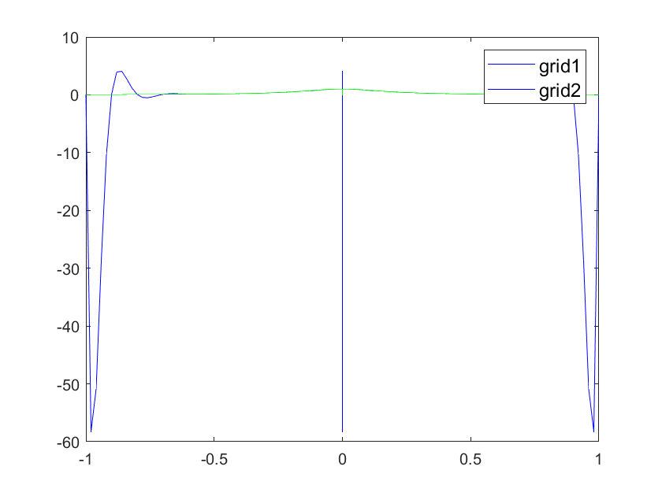

# 第二周程序作业

## Problem
对函数$f(x)=\frac{1}{25x^2+1}，x\in [-1,1]$，构造Newton插值多项式$p_N(x)$，插值节点取为:

1. $x_i=1-i \frac{2}{N}, i = 0, 1, · · · , N$

2. $x_i = −cos(\frac{2i + 1}{2N + 2}\pi), i = 0, 1, · · · , N$ (Chebyshev point)

并计算如下误差$max_i{|f (y_i) − p(y_i)|, y_i =\frac{i}{50}− 1, i = 0, 1, · · · , 100}$

对N = 5, 10, 20, 40比较以上两组节点的结果，并在一张图中画出N = 20时$f (x)$数值计算结果。

## Method
对给定的插值节点，计算n阶差商$f[x_0,\dots,x_n]$，构造Newton插值多项式
$$p_N(x)=\sum_{k = 0}^{n}  f[x_0,\dots,x_k]\prod _{i=0}^{k-1}(x-x_i)$$

计算n阶差商并以此计算Newton插值多项式的算法来自书246页

## Result

|n |max error of grid 1|max error of grid 2|
|---|---|---|
 | 5|   0.432692   |  0.555911  |
  |10|   1.915643   | 0.108929 |
  |20|   58.278125   | 0.015325 |
  |40| 78689.049377   | 0.000274 |

 